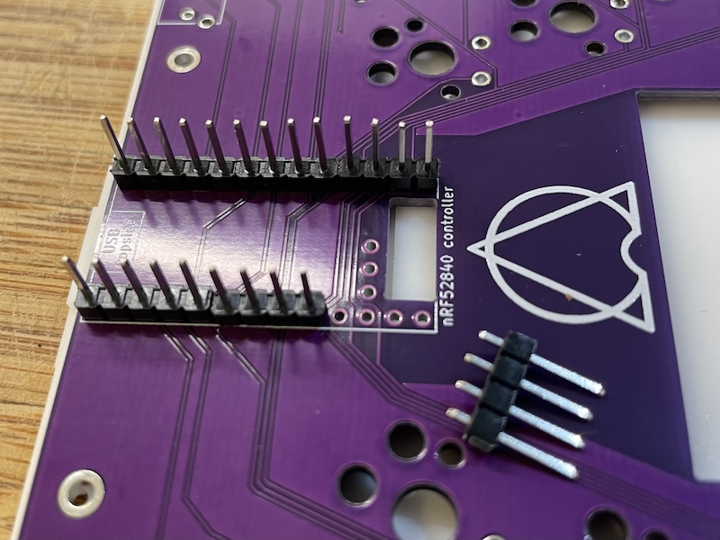
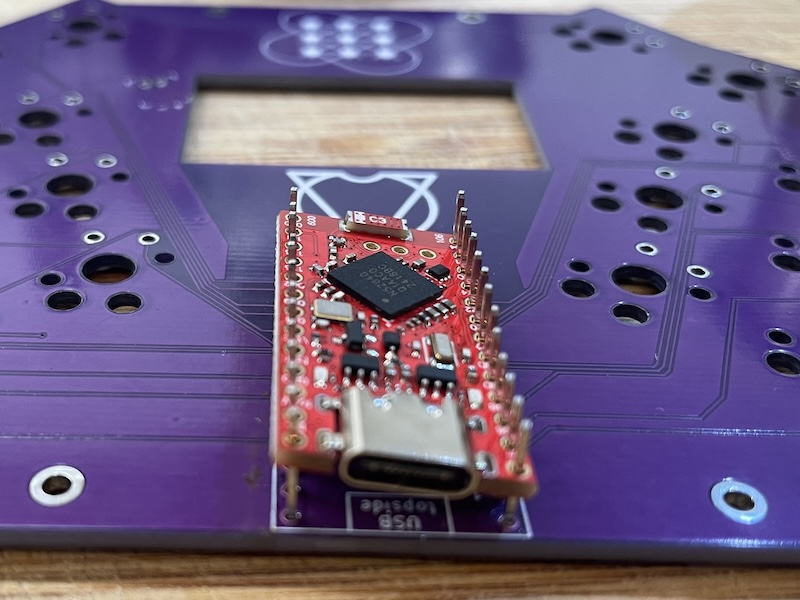
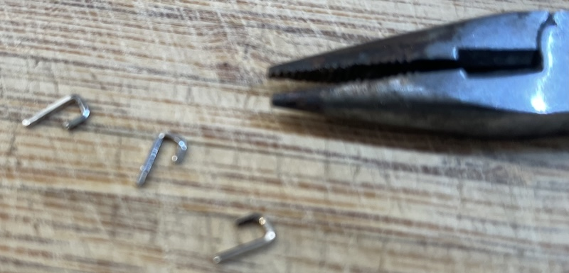
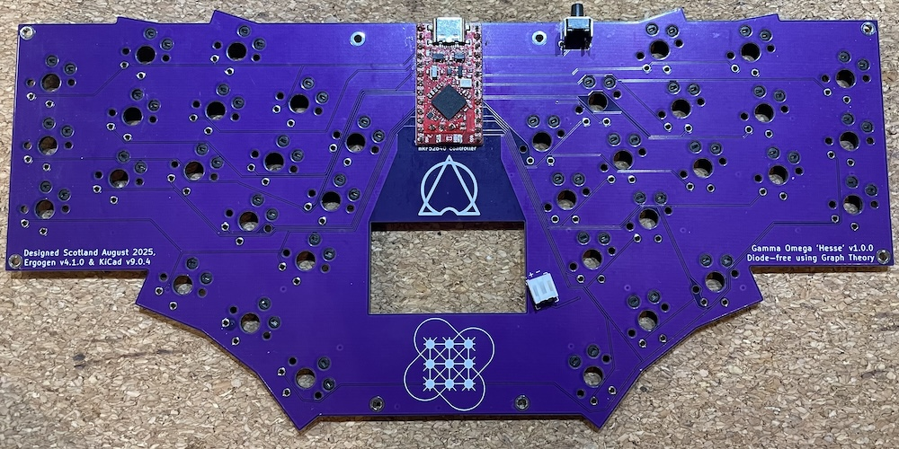
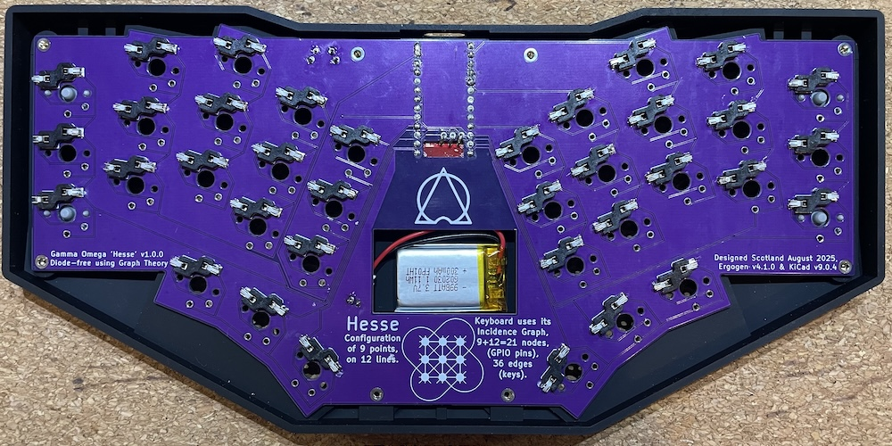
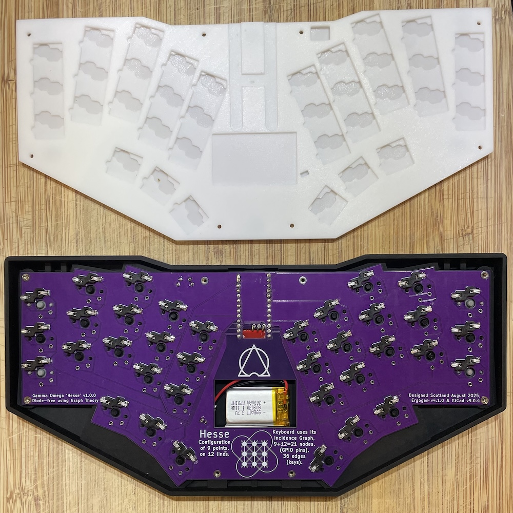
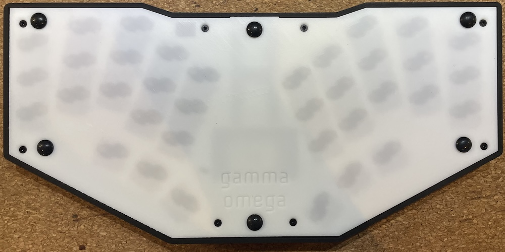
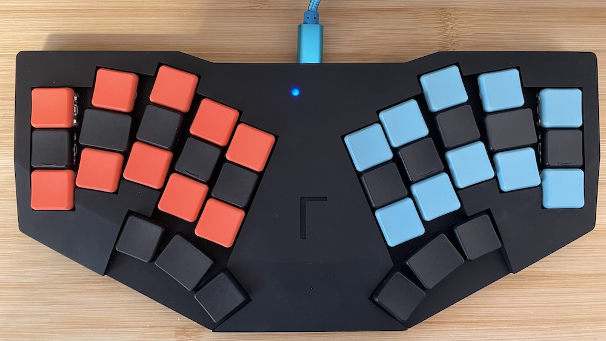
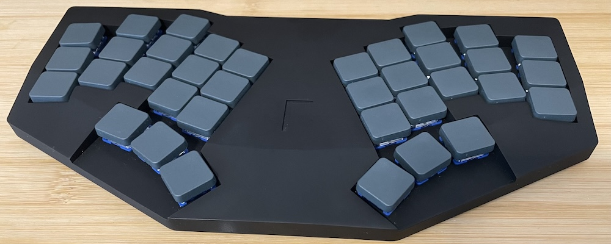

# Hesse Build guide

Looking for the [original's build guide](../original/BUILD_GUIDE.md),
or the [TC36K's build guide](../tc36k/BUILD_GUIDE.md)?

# Parts List
| Part | Quantity | Details | Source |
|------------------|----------|-----------------|--------|
| M2x2x3 Insert nut | 4 | M2 thread, 2mm length, 3.0mm outer diameter | |
| M2x6x3 Insert nut | 4 | M2 thread, 6mm length, 3.0mm outer diameter | |
| M2x6 Countersunk screw | 4 | 6mm length | |
| M2x8 Countersunk screw | 4 | 8mm length (or 6mm × 8) | |
| Feet bumpons | 6 | 8mm diameter, any height. | |
| Kailh Choc PG1350 HotSwap Sockets | 36 | 💡 |
| Kailh Choc switches | 36 | PG1350 | 💡 |
| Keycap | 36 | MBK, CFX, THCS, ... | |
| Gamma Omega Hesse PCB | 1 | 1.6mm thickness | JLCPCB |
| Hesse Top case | 1 | SLA Resin | JLC3DP |
| Hesse Bottom case | 1 | SLA Resin | JLC3DP |
| 6x6x8H right angle reset switch | 1 | 90 degree reset switch like [Tyco Electronics (TE) 1825027-8](https://www.te.com/en/product-1825027-8.html), with a sideways 6x6mm base and 8mm from back of base to end of the button. | e.g. [AliExpress](https://www.aliexpress.com/item/4000275201465.html) |
| JST connector | 1 | JST PH 2.0mm | |
| 3.7V LiPo battery | 1 | eg 500mAh LP702035 with JST connector | 💡 |
| Nice!Nano v2 or clone | 1 | The [SuperMini NRF52840](https://kriscables.com/supermini-nrf52840/) aka [ProMicro NRF52840](https://www.nologo.tech/product/otherboard/NRF52840.html) is tested. | [Offical](https://nicekeyboards.com/nice-nano#find-a-store), [AliExpress](https://www.aliexpress.com/item/1005006035267231.html) |
| Pin headers/diode legs | 35+ | Use the headers included with the controller |  |

> [!WARN]
> The PCB design mounts the controller face up directly on the PCB, faux-castellated style.
> This is not easy for a novice at soldering.

> [!NOTE]
> The mounting holes for the extra middle trio of pins are different between the Nice!Nano v2 and clones.
> Using a clone controller requires bridging this with bent pins.

> [!NOTE]
> No-stabilizer Choc v2 switches work too, the central hole is large enough.
> However, since the key spacing is 18x17mm, there are not many compatible keycaps.
> Consider the Tai Hao "THCS" or square "MT 165" with the cross stem option.

> [!TIP]
> This PCB allows directly soldering the choc switches (rotated 180 degrees) without using hot-swap sockets.
> However, that will not work with the suggested case bottom (which has hot-swap cut-outs).

> [!TIP]
> The battery compartment will take a 300mAh LP602030 3.7V LiPo battery with ample space to spare.
> A 500mAh LP702035 500mAh should fit comfortably and is suggested, but as yet untested.
> If you want so push it, the largest that might fit is probably a LP802040 - 650mAh,
> again please let us know how that goes if you try.

> [!TIP]
> 3D printing varies, but with my case the 6x6x7H right angle switch was too short, and while
> the 6x6x8H is easy to press it sticks out a fraction. The in-between 7.5mm version might be
> a better choice (untested).

## Tools

- Soldering tools.
- Safety gears.
- Wire cutters (to trim controller header pins).
- Circuit tester.
- USB cable and computer (for flashing the controller).
- epoxy adhesive (or cyanoacrylate adhesive) for fixing insert nuts.

> [!WARNING]
> For your safety: Wear protective eyewear, be cautious of hot components, and ensure proper ventilation to avoid inhaling toxic fumes.

## Firmware Flashing

1. Download the [hesse-nice_nano_v2-zmk.uf2](https://github.com/peterjc/zmk-keyboard-graph-theory/releases/download/latest/hesse-nice_nano_v2-zmk.uf2) firmware.
2. Connect the controller, the clones are pre-loaded with a blink program.
  * Check the left LED flashes once a second.
  * Check the right LED turns on or off every second.
  * With a multimeter check all 21 GPIO pins cycle from 0 to 3.3V once a second.
3. Short the reset pin (RST) to any of the ground pins (GND) twice in a second (just tap a few times).
4. USB Mass Storage device named `NICENANO` appears.
5. Copy the `hesse-nice_nano_v2-zmk.uf2` firmware file to this storage device.
  * On macOS you may get a error code -36 about failing to complete. This seems to be harmless.
6. The storage will disconnect automatically.
  * On macOS you well get a notification recommending unmounting before disconnecting.
7. The device should now function as a keyboard.
  * The battery charging LED will continue to flash with no battery connected.
  * You can try shorting pins like `D1/P0.06` and `D0/P0.08` top left which should type Qwerty `E`.
7. Disconnect the USB cable to the controller.

> [!TIP]
> It is a little fiddly without a reset button, but flashing *before* soldering to
> the PCB should catch a bad controller early on.

## Nice!Nano v2 or Clone Installation

We will install the controller face up on the UP side of the PCB
(opposite from where hotswap sockets will be installed), with the LEDs facing the user.

1. Break the two long header pins into blocks of three or four pins (to make removal easier later).
2. Push the pins further through the blocks, leaving about 2mm at the short end.
3. Solder these into the PCB with the block and long ends facing up.

4. Place the PCB in the bottom case to check the short pins don't stick out too much.
5. Solder the short pins on the back (same side as the hotswap pads).
6. Test things so far:
  * Carefully thread the controller onto the long pins.
  * Tilt the controller at slight angle to help ensure connections.
  * Plug in the USB and test shorting each key's switch.
  * The right thumbs and two right-most columns can be tested using the three middle pins.
  * Unplug the USB.

7. Remove the controller, remove the header blocks with pliers.
8. Straighten the pins, and fix any lost pins individually.
9. Again carefully thread the controller onto the long pins, flat on the PCB this time.
10. Clip the pins to at most 2mm above the controller.

> [!CAUTION]
> For your safety, please do this in a bag and/or wear safety glasses — trimmed pins can be sharp and may fly off during cutting.

11. Solder the controller pins using as little solder as possible.
12. Connect the USB, retest, unplug.
13. Solder the last three pins in the middle.
  * Use a similar technique with the official Nice!Nano v2 controller
  * For the clones, use needle nose pliers to pre-bend three pins into a staple-like hook.
    Aim for a short leg of about 1.5mm, then about 2mm horizontal, leaving a long leg down.
    This must not stick up too much or it will block the top case.
    Solder the three pins one-by-one, starting with the small leg in the controller.

14. After soldering, check the case fitting, and carefully trim any protruding pins with a nipper.

## Test Soldered Controller

Connect the USB-C port on the controller mounted on the PCB, and it should still register as a keyboard.
The power LED will be flashing (since there is no battery yet).

Use your favorite keystroke tester with conductive tweezers to verify that all keys are working properly.

## Hotswap Socket Installation

1. Install hotswap sockets according to the PCB markings.
2. Ensure correct orientation of the sockets; while they can physically fit in either direction, the bottom case cutouts are designed for the correct orientation only.
3. Test the soldered connection of each hotswap pad with a circuit tester using the 180-degree rotated direct solder holes. That's 72 tests, but very easy!

## Reset Button

> [!TIP]
> If you have several sizes, please do a trial fit of the switch, PCB, and top case to pick
> the best button length. For me the 7mm was too short, and the 8mm sticks out a fraction,
> so the 7.5mm version could be better?

1. Insert the right angle reset button from the front side (which has the controller).
2. Once clicked into place, temporarily insert the PCB into the top case to confirm the shaft length.
2. Solder the four legs from the back (the side which has the hotswaps).

## Battery Connection

The connector  will be on the top (like the controller), but the two legs are soldered from the bottom.
This is a standard through hole component, and should be easily soldered.

Before assembly, test connecting the battery cable connector to the JST socket.
Make sure the red wire matches positive on both PCB (remember it sits on the top side) and on the battery markings.
Likewise, check the black wire matches negative on the PCB and on the battery markings.

Get a feel for the force needed to connect and disconnect it. Do not pull the wires, pull the plug.

1. Test the battery plug fits the JST connector, then disconnect it.
2. Insert the JST connector into the PCB from the front side (which has the controller),
3. Solder the two legs from the back (the side which has the hotswaps).

## PCB Done

Your PCB should look like this when completed:

## Battery Testing

1. With the controller NOT connected by USB, connect the battery using the JST socket.

> [!TIP]
> The battery may be empty on shipping, so we don't expect anything to happen when connecting it.

2. Connect the USB port.
3. The battery should start charging - note the change in the LED to solid on.
4. The keyboard should be broadcasting as "Hesse" on Bluetooth.
5. Wait a few minutes, monitor the battery for signs of overheating.
6. Disconnect the USB.
7. Check "Hesse" is still advertised on Bluetooth.
8. Disconnect the battery, or continue to case assembly.

## Case Assembly

1. Install 6mm threaded inserts with epoxy adhesive on the top case (upper side, near the USB port hole).
2. Install 2mm threaded inserts with epoxy adhesive on the top case (lower side, opposite the USB port hole).

> [!TIP]
> You may not need the glue, mine seems fine with friction alone.

3. (Re)connect the battery, keep it on the hotswap side with the wire though the battery cutout.
4. Place the PCB into the top case, taking care to align the reset button and USB port (battery free on top).
5. Place battery into the compartment, rotated to place no stress on the cable.

6. Install switches into the top case while holding the PCB and hotswap sockets in place.
7. Adjust battery and wire to fit inside.

8. Place the bottom case onto the top case assembly.
9. Secure with screws (8mm or 6mm for upper side, 6mm for lower side).

> [!TIP]
> Do not over-tighten: the screws should only need to support the bottom case's weight.

> [!CAUTION]
> If the top case has warped ever so slightly, then the switches and outer screws should bend it straight.

10. Apply the six feet bumpon stickers to the sunken circles on the case bottom.

11. Give it a test (sometimes hotswaps can be loosened by the switch), then add the keycaps.

## DONE!

Here is my Hesse with a black resin case, Kailh Choc v1 50g 'red' switches, and Chosfox CFX
keycaps (which are square and slightly narrower). This used black blanks for the home row and
thumbs, orange for the top and bottom on the left, and pale blue for top and bottom on the right.
I used homing keys for the index and pinky fingers, and am using wider 1.25u keycaps for the
middle thumb buttons and the S and L keys.
This is plugged in and charging with a matching blue USB cable:

The power LED (blue on the clone controllers) can be easily seen through the black resin case.
The red user LEDs is more muted.

And here is the same black keyboard with 35g Kailh Islet Pink Mini Low Profile Silent Linear
Switches (which are Choc v2 with the cross stem), and the very flat Tai-Hao THCS keycaps in
their greenish grey 'Navy' option. They currently do not offer any homing keys in this size:

### Everything is done.

The keyboard should work as a USB keyboard while plugged in, and will charge the battery.
See the ZMK documentation for handling Bluetooth connections.

How does it feel? Comfortable? Any issues? Does it work as you expected?

Whatever the result, we’d really appreciate it if you shared your experience with the community.

Thank you for building it!
