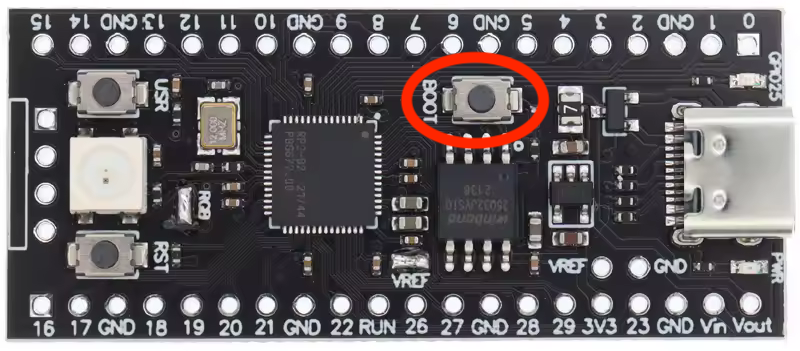

# TC36k Build guide

[looking for the original's build guide?](../original/BUILD_GUIDE.md)

> [!WARNING]
> Work in progress

# Parts List
| Part | Quantity | Details | Source |
|------------------|----------|-----------------|--------|
| M2x2 Insert nut | 4 | 2mm length, 3.0mm diameter | |
| M2x6 Insert nut | 4 | 6mm length, 3.0mm diameter | |
| M2x6 Countersunk screw | 4 | 6mm length | |
| M2x8 Countersunk screw | 4 | 8mm length (or 6mm × 8) | |
| Feet bumpons | 6 | 8mm diameter, any height. | |
| Kailh Choc PG1350 HotSwap Sockets | 36 | 💡 |
| Kailh Choc switches | 36 | PG1350 | 💡 |
| Keycap | 36 | MBK, CFX, ... | |
| Gamma Omega TC36K PCB | 1 | 1.6mm thickness | JLCPCB |
| Top case | 1 | SLA Resin | JLC3DP |
| Bottom case | 1 | SLA Resin | JLC3DP |
| Pi Pico USB-C RP2040 | 1 | YD-RP2040 Variants are tested. [Info](https://circuitpython.org/board/vcc_gnd_yd_rp2040/) | [Aliexpress](https://a.aliexpress.com/_opuRQZl) ⚠️ |

> [!NOTE]
> The bottom case and PCB has a hole allowing access to the boot button on the RP2040 controller, which is mounted facing down once fully assembled.
> The placement of any boot/reset/user buttons varies between boards, even if they are pin-compatible.
> The expected placement (looking at the controller chips upward with the USB and pin 1 at the top) is on the left near pins 7, 8 & 9 (GP5, GND & GP6).
> This is the "black" controller at the Ali Express link:
> 
>
> This Pi Pico variant has 28 GPIOs available (GP29 and GP23 on pins 35 and 37),
> required in the original Gamma Omega dual PCB design, but which are unused in the TC36K PCB.
> As long as you don't care about the boot button, standard 26 GPIO Pi Pico designs *should* be fine (untested).

> [!TIP]
> Actually, the PCB should be compatible with choc v2 and Lofree POM switches (*untested*).
> However, since the key spacing is 18x17mm, there may be issues with keycap compatibility. Please keep this in mind.

> [!TIP]
> This PCB allows directly soldering the choc switches (rotated 180 degress) without using hot-swap sockets.
> However, that will not work with the suggested case bottom (which has hon-swap cut-outs).
