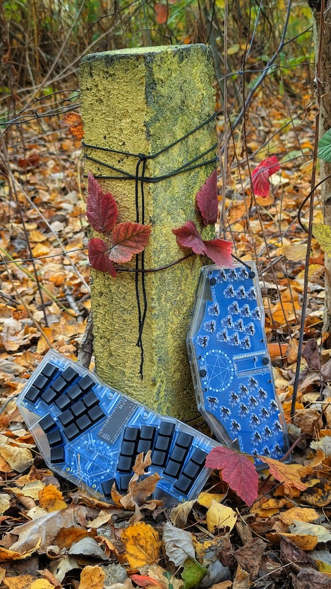
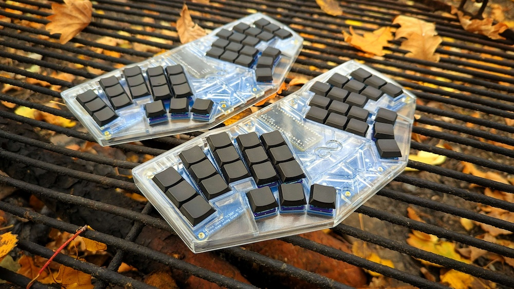
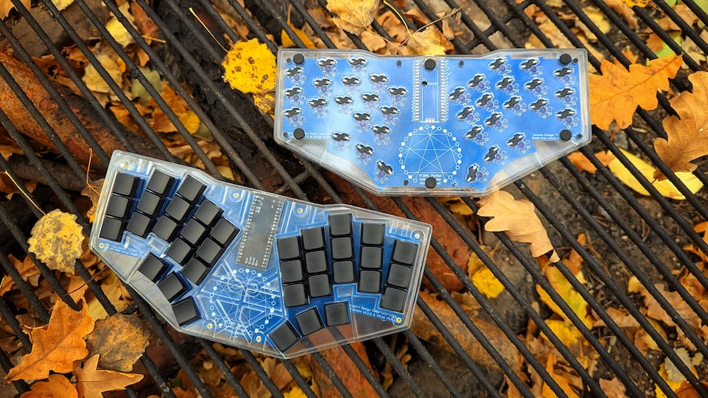

# Gamma-Omega TC36K - USB mono PCB without diodes

## Quick Links
- [3D Printable Case](../cases/)
- [PCB](pcb/) including the Gerbers ZIP file for getting the PCB fabricated at JLCPLC or similar,
  and BOM & position files which might work for assembly with the hot-swap sockets (untested as the
  parts were not available).
- [Ergogen Configuration](ergogen/README.md) 
- Firmware (which is *different* to the original Gamma Omega):
    - [TC36K QMK/VIAL Implementation](https://github.com/peterjc/qmk_userspace/tree/main/keyboards/tutte_coxeter_36k/)
    - [TC36K ZMK Firmware](https://github.com/peterjc/zmk-keyboard-graph-theory/tree/main/boards/shields/tc36k)
- [Build Guide](BUILD_GUIDE.md)

## Photos

The first TC36K build by [@peterjc](https://github.com/peterjc/), who designed the PCB, in black resin with purple MBK keycaps:

 

A pair of TC36K built by [@Celepara](https://github.com/Celepara) in transparent resin with blue PCB and black DDC keycaps:

  

## PCB design

The [original Gamma-Omega](../original/) has a left & right PCB (with the same reversible design),
joined at the middle with the controller daughter board itself.

The *Gamma Omega TC36K* is an alternative larger single PCB design, intended to fit the same case.
Larger PCBs are more expensive, doubly so with the typical minimum order of five - so why do this?
This is a [no-diode design using graph theory to have a 36 key keyboard using only 26 GPIO
pins](https://astrobeano.blogspot.com/2025/05/ergo-mech-keyboard-wiring-using-tutte-coxeter-graph.html).
The cost saving for no diodes is minimal, but with far less parts and soldering,
this design should be quicker and easier to assemble.

Specfically, it uses a partial *Tutte Coxeter graph*, with only 26/30 nodes/vertices/pins,
and 36/45 edges/switches/keys (thus "TC36K"), but still girth 8 for 6-key rollover. 
This needs _different_ firmware to the original Gamma Omega design, see
[Tutte Coxeter 36K firmware (QMK)](https://github.com/peterjc/qmk_userspace/tree/main/keyboards/tutte_coxeter_36k)
or using [ZMK](https://github.com/peterjc/zmk-keyboard-graph-theory/tree/main/boards/shields/tc36k).

## Credits

[triliu/Heawood42](https://github.com/triliu/Heawood42) - the first no-diode keyboard using graph theory (42 key split)

[triliu/JESK56](https://github.com/triliu/JESK56) - later no-diode 56 key monoblock keyboard using graph theory

